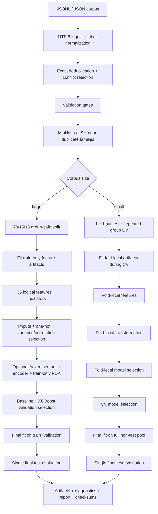
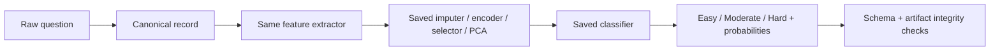

# Execution Flow

## Training

## Inference

The implementation reuses the same feature-extraction code for training and inference. Fitted artifacts are loaded rather than refit. Test data is never used by inference.
